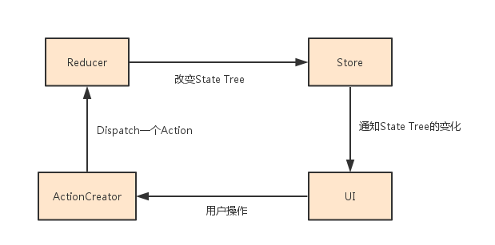

# Redux

##  Why
> 随着 JavaScript 单页应用开发日趋复杂，JavaScript 需要管理比任何时候都要多的 state （状态）。 这些 state 可能包括服务器响应、缓存数据、本地生成尚未持久化到服务器的数据，也包括 UI 状态，如激活的路由，被选中的标签，是否显示加载动效或者分页器等等。

> 管理不断变化的 state 非常困难。如果一个 model 的变化会引起另一个 model 变化，那么当 view 变化时，就可能引起对应 model 以及另一个 model 的变化，依次地，可能会引起另一个 view 的变化。直至你搞不清楚到底发生了什么。state 在什么时候，由于什么原因，如何变化已然不受控制。 当系统变得错综复杂的时候，想重现问题或者添加新功能就会变得举步维艰。

> 这里的复杂性很大程度上来自于：我们总是将两个难以厘清的概念混淆在一起：变化和异步。 我称它们为曼妥思和可乐。如果把二者分开，能做的很好，但混到一起，就变得一团糟。一些库如 React 试图在视图层禁止异步和直接操作 DOM 来解决这个问题。美中不足的是，React 依旧把处理 state 中数据的问题留给了你。Redux就是为了帮你解决这个问题。

通过本系列之前内容的学习，我们了解到React的原理实际上可以理解为：UI=fn(state)，UI的变化由State决定。然而，如何维护State，更新State并不属于React关心的内容。

Redux依靠单向的数据流，使得State的维护更加清晰，可预测，可维护。

##  单向数据流
什么是单向数据流？让我们先看下面这张图：



我们在图中看到很多的新的概念，比如：ActionCreator，Action，Reducer，Store，State Tree...先对这个图有个印象，了解完本章内容，再来回来看这个图会更理解其中的原理。

下面我们就开始了解一下，Redux是如何让我们利用单向数据流管理State的。

##  三大原则
### 单一数据源
整个应用的 state 被储存在一棵 object tree 中，并且这个 object tree 只存在于唯一一个 store 中。

### State只读
惟一改变 state 的方法就是触发 action，action 是一个用于描述已发生事件的普通对象。

### 通过纯函数修改State
为了描述 action 如何改变 state tree ，你需要编写 reducers。Reducer 只是一些纯函数，它接收先前的 state 和 action，并返回新的 state。

##  一个小示例
结合单向数据流图和三大原则，我们来看一个实际的示例，理解单向数据流是如何工作的：

[Example:Counter](codes/10.redux/1.counter)
``` javascript
// index.js
'use strict';

import React from 'react';
import ReactDOM from 'react-dom';
import { createStore } from 'redux';
import Counter from './components/Counter';
import counter from './reducers';
import { increment, decrement } from './actions';

// 创建全局唯一的store，插入reducers
const store = createStore(counter);

// 呈现应用的组件
function render() {
    // 呈现时输出当前的state tree
    console.log(`state tree:    ${JSON.stringify(store.getState())}`);

    // 在div中插入组件，值来自于store.getState()，点击事件触发store.dispatch()
    ReactDOM.render(
        <Counter
            value={store.getState().count}
            onIncrement={() => store.dispatch(increment())}
            onDecrement={() => store.dispatch(decrement())}
        />,
        document.getElementById('app')
    )
}

// 初始调用render函数
render();
// 监听store，如果store中的state tree发生变更，则调用render函数重新渲染
store.subscribe(render);
```

从这个示例中，我们可以窥得Redux的基本处理流程：

1.  通过`createStore`函数，插入`reducers`，创建一个对于整个应用唯一的`store`，其中维护一个`state tree`；
2.  `render`函数将`Counter`组件呈现到div中，`Counter`组件的`value`值从`store.getState()`返回的`state tree`中获取；
3.  当用户触发`onIncrement`或`onDecrement`事件时，通过`store.dispatch`分发`action`到`reducers`处理（其中，`action`是一个带有type属性的对象，由`actionCreator`产生）；
4.  `reducers`是一些纯函数，接收旧的`state tree`和`action`，返回新的`state tree`；
5.  由于`state tree`发生了变化，此时`store`会通知并调用订阅的函数：`render`（通过`store.subscribe()`订阅）

##  基本组成
### Action
首先，让我们来给 action 下个定义。

>Action 是把数据从应用传到 store 的有效载荷。它是 store 数据的唯一来源。一般来说你会通过 store.dispatch() 将 action 传到 store。

Action本质上是一个普通的javascript对象，用于描述发生的事情，其中type属性是约定的，一般使用常量标识发生的事情。

例如：
```
const INCREMENT = 'INCREMENT';

{
  type: INCREMENT,
  ... // 可以携带任何有用的参数
}
```

### Action Creator
Action Creator是生成action的方法。上节说到Action是一个纯粹的javascript对象，而Action Creator函数用于返回Action。

一般我们除了会在Action Creator中返回Action外，还会做一些其他的操作，如：服务端交互，数据持久化...我们会在异步Action中讨论这些内容。

### Reducer
好了，我们定义了Action Creator来返回Action，描述"有事情发生了"这一事实，并没有指明应用应该如何更新state。而这正是reducer要做的事情。

``` javascript
'use strict';
import {INCREMENT, DECREMENT} from '../actions';

const stateTree = {count: 0};

function counter(state = statTree, action) {
    switch (action.type) {
        case INCREMENT:
            return {count: state.count + 1};
        case DECREMENT:
            return {count: state.count - 1};
        default:
            return state;
    }
}

export default counter;
```

我们定义了一个stateTree，作为初始化的state。并且，定义了一个`counter(state, action)`函数，处理action操作。
要注意的是：

1.  不要修改传入的state和action，且总是返回新的state；
2.  不要执行有副作用的操作，如API请求和路由跳转；
3.  不要调用非纯函数，如：Date.now() 或 Math.random();
4.  在default情况下返回旧的state。

####  拆分Reducer
设想一下如果应用变得更大，在一个reducer中处理一堆不相干的action，会带来一些维护上的混乱。
比如：

我们在原来的1.counter的基础上，添加了一个输入转换组件，从redux的原则上来看，我们需要这样一个新的reducer：

``` javascript
'use strict';
import {COUNTER_INCREMENT, COUNTER_DECREMENT} from '../actions/counter';
import {WRITER_CHANGE} from '../actions/writer';

const stateTree = {count: 0, text: '输入的内容是: '};

function reducers(state = stateTree, action) {
    switch (action.type) {
        case COUNTER_INCREMENT:
            return {count: state.count + 1};
        case COUNTER_DECREMENT:
            return {count: state.count - 1};
        case WRITER_CHANGE:
            return {text: `输入的内容是:   ${action.text}`};
        default:
            return state;
    }
}

export default reducers;
```

上面代码的弊端是很明显的，随着应用变大，stateTree会不断变大，维护会变得越来越困难。因此，redux提供了一个`combineReducers`函数能让我们拆分 Reducer。

[拆分后的代码示例](codes/10.redux/2.counter&writer)

``` javascript
// reducers/counter.js
'use strict';
import {COUNTER_INCREMENT, COUNTER_DECREMENT} from '../actions/counter';

const initState = {count: 0};

function counter(state = initState, action) {
    switch (action.type) {
        case COUNTER_INCREMENT:
            return {count: state.count + 1};
        case COUNTER_DECREMENT:
            return {count: state.count - 1};
        default:
            return state;
    }
}

export default counter;
```

``` javascript
// reducers/writer.js
'use strict';
import {WRITER_CHANGE} from '../actions/writer';

const initState = {text: '输入的内容是:   '};

function counter(state = initState, action) {
    switch (action.type) {
        case WRITER_CHANGE:
            return {text: `输入的内容是:   ${action.text}`};
        default:
            return state;
    }
}

export default counter;
```

``` javascript
// reducers/index.js
'use strict';
import {combineReducers} from 'redux';

import counter from './counter';
import writer from './writer';

export default combineReducers({counter, writer});
```

每个`reducer`只负责管理全局state tree中它负责的一部分。每个`reducer`的state参数都不同，分别对应它管理的那部分state数据。

试一下:
```
npm install
npm start
访问: http://localhost:5000
```

观察console的输出，我们会注意到虽然我们拆分了reducers和state tree，但是这并不代表我们拥有多个store或多个state tree。应用依然只存在一个唯一的state tree，只不过根据reducer的名称进行了组合。
比如：点击两下+,再输入111，我们会在console中看到这样的输出

```
state tree:    {"counter":{"count":1},"writer":{"text":"输入的内容是:   "}}
state tree:    {"counter":{"count":2},"writer":{"text":"输入的内容是:   "}}
state tree:    {"counter":{"count":2},"writer":{"text":"输入的内容是:   1"}}
state tree:    {"counter":{"count":2},"writer":{"text":"输入的内容是:   11"}}
state tree:    {"counter":{"count":2},"writer":{"text":"输入的内容是:   111"}}
```

### Store
好了，我们学会了使用 action 来描述“发生了什么”，和使用 reducers 来根据 action 更新 state 的用法。

Store 就是把它们联系到一起的对象。Store 有以下职责：

1.  维持应用的 state；
2.  提供 getState() 方法获取 state；
3.  提供 dispatch(action) 方法更新 state；
4.  通过 subscribe(listener) 注册监听器。

##  结合React
让我们回顾一下TodoApp的案例[代码](codes/8.react%20webpack)的组成:

1.  一个叫app的容器组件(container)
2.  一些包裹在app中的展示组件(component)
3.  展示组件的数据模型由容器组件通过props注入
4.  app的数据模型存放在一个全局唯一的state中
5.  state的改变是通过一些函数来处理的，而这些函数由用户操作触发

天哪！发现了没有？是不是有点redux的影子？来吧，让我们在这个案例上改造一下，真正的把redux和react结合起来。

什么？有人会说：嘿，在本章*一个小示例*里我们已经用上了react！

是的，我们可以通过`store.subscribe`注册并监听`store`的变化，然后重新调用根部的`render`函数，这样达到了目的。但是，到了实际开发中，你不会想只有根部能监听`store`的变化，然后把`store`逐层向子组件传递的。因为你的痛苦会随着层级的深度递增。

[新的TodoApp](codes/10.redux/3.todoApp)(*我选择注释原来的代码，并加上新的代码，方便我们对比其中的变化*)

### 1.使用react-redux监听redux的store
为了能将redux和react绑定，我们需要一个额外的绑定库：[react-redux](https://github.com/reactjs/react-redux)
```
npm install --save-dev react-redux
```

首先看一下index.js改造后的代码：
``` javascript
// index.js
'use strict';
import React from 'react';
import ReactDOM from 'react-dom';
import {Provider} from 'react-redux';// 引入react-redux
import TodoApp from './container/app';
import store from './store';// 通过redux创建的全局store对象

// ReactDOM.render(
//     <TodoApp />,
//     document.getElementById('app')
// );
// 使用一个Provider组件包裹整个TodoApp组件
ReactDOM.render(
    <Provider store={store}>
        <TodoApp />
    </Provider>,
    document.getElementById('app')
);
```

我们引入了react-redux这个库，来帮助我们方便的使用redux。react-redux库的代码很短，主要是提供了两个组件：[`Provider`](https://github.com/reactjs/react-redux/blob/master/src/components/Provider.js)和[`connect`](https://github.com/reactjs/react-redux/blob/master/src/components/connect.js)。

`Provider`在根部接收一个store属性，并传给子组件的context。
`connect`包裹需要使用store的组件。这个包裹组件从context中获取store对象，并在内部维护一个state绑定到store的state tree，然后监听store的变化，并更新state。同时，被包裹的组件（比如：我们这里的TodoApp）通过mapStateToProps等函数，从store中选取关心的内容。

`connect`的使用可以查看下面的代码：
``` javascript
// app.js
import React from 'react';
import {ENTER_KEY_CODE, SHOW_ALL, SHOW_COMPLETED, SHOW_ACTIVE, TODO_FILTERS, FILTER_TITLES } from '../constants';
//import todoState from '../state';// 拿掉state，使用redux的store替代
import {connect} from 'react-redux';// 引入react-redux
import Header from '../component/Header';
import MainSection from '../component/MainSection';
import Footer from '../component/Footer';
import {saveTodo, destroyTodo, updateText, toggleCompleteAll, toggleComplete, destroyCompleted, selectFilter} from '../actions';// 引入actionCreators

class TodoApp extends React.Component {
    //constructor(props) {
    //    super(props);
    //    this.state = todoState;
    //}

    static propTypes = {
        todoState: React.PropTypes.object.isRequired// 从store中映射的state tree
    };

    render() {
        const {todoState} = this.props;
        return (
            <div>/
                <Header onSave={this._onSave.bind(this)}/>
                <MainSection
                    allTodos={todoState.allTodos}
                    areAllComplete={todoState.areAllComplete}
                    updateText={this._updateText.bind(this)}
                    toggleCompleteAll={this._toggleCompleteAll.bind(this)}
                    toggleComplete={this._toggleComplete.bind(this)}
                    destroy={this._destroy.bind(this)}
                    selectedFilter={todoState.selectedFilter}
                />
                <Footer allTodos={todoState.allTodos}
                        destroyCompleted={this._destroyCompleted.bind(this)}
                        selectedFilter={todoState.selectedFilter}
                        onFilter={this._filter.bind(this)}
                />
            </div>
        );
    }

    // event handles
}

// 将store的state tree映射为组件的props
function mapStateToProps(state) {
    return {
        todoState: state
    }
}

// 将store中的state tree映射到TodoApp的props中
export default connect(mapStateToProps)(TodoApp);
```
通过`connect`，我们从store中拿到了state tree（通过props）。想一下，此时只要根部的store变化，connect包裹组件中的state会变化，进而map到props中的值也就跟着变化，这就达到了使用全局store的目的。

这么看起来，`connect`像是一种黑魔法，凡是需要使用store的组件，connect一下，就是这么简单。

但是，我们并没有这么做，我们只是把container目录中的`TodoApp`组件和store connect了，component目录中的组件都没有感知到store的存在（通过props从TodoApp注入数据和事件处理函数）。这两种组件，有两个的名字：容器组件（Smart/Container Components）和展示组件（Dumb/Presentational Components）。关于两者分离的开发思想，可以看[Redux的作者怎么说](https://medium.com/@dan_abramov/smart-and-dumb-components-7ca2f9a7c7d0#.kyy2xf4n1)。

### 2.编写actionCreator告诉store发生了什么
第一步中我们已经能在TodoApp中感知store，下面我们要做的是通过action告诉store发生了一些有趣的事。
``` javascript
// actions/index.js
'use strict';
export const SAVE_TODO = 'SAVE_TODO';
export function saveTodo(text){
    return {
        type: SAVE_TODO,
        text: text
    }
}

export const DESTROY_TODO = 'DESTROY_TODO';
export function destroyTodo(id){
    return {
        type: DESTROY_TODO,
        id: id
    }
}

export const UPDATE_TEXT =  'UPDATE_TEXT';
export function updateText(id, text){
    return {
        type: UPDATE_TEXT,
        id,
        text
    }
}

export const TOGGLE_COMPLETE_ALL = 'TOGGLE_COMPLETE_ALL';
export function toggleCompleteAll(){
    return {
        type: TOGGLE_COMPLETE_ALL
    }
}

export const TOGGLE_COMPLETE = 'TOGGLE_COMPLETE';
export function toggleComplete(todo){
    return {
        type: TOGGLE_COMPLETE,
        todo
    }
}

export const DESTROY_COMPLETED = 'DESTROY_COMPLETED';
export function destroyCompleted(){
    return {
        type: DESTROY_COMPLETED
    }
}

export const SELECT_FILTER = 'SELECT_FILTER';
export function selectFilter(filter){
    return {
        type: SELECT_FILTER,
        filter
    }
}
```

然后，在app.js中引入这些actionCreator并修改事件处理函数：
``` javascript
// app.js
// import ..
import {saveTodo, destroyTodo, updateText, toggleCompleteAll, toggleComplete, destroyCompleted, selectFilter} from '../actions';// 引入actionCreators

class TodoApp extends React.Component {
    //constructor(props) {
    //    super(props);
    //    this.state = todoState;
    //}

    static propTypes = {
        todoState: React.PropTypes.object.isRequired// 从store中映射的state tree
    };

    render() {
        // ..
    }

    // event handles
    _onSave(text) {
      //if (text.trim()) {
      //    let id = (+new Date() + Math.floor(Math.random() * 999999)).toString(36);
      //    todoState.allTodos.push({
      //        id: id,
      //        complete: false,
      //        text: text
      //    });
      //    todoState.areAllComplete = false;
      //    this.setState(todoState);
      //}
      // 使用props中注入的dispatch，向store发送action
      this.props.dispatch(saveTodo(text));
    }

    _destroy(id) {
        //todoState.allTodos = todoState.allTodos.filter(function (todo) {
        //        return todo.id !== id;
        //    }
        //);
        //todoState.areAllComplete = this._areAllComplete();
        //this.setState(todoState);
        this.props.dispatch(destroyTodo(id));
    };

    _updateText(id, text) {
        //todoState.allTodos = todoState.allTodos.map(function (todo) {
        //    if (todo.id === id) {
        //        todo.text = text;
        //    }
        //    return todo;
        //});
        //this.setState(todoState);
        this.props.dispatch(updateText(id, text));
    }

    _toggleCompleteAll() {
        //let complete = false;
        //todoState.areAllComplete = this._areAllComplete();
        //complete = !todoState.areAllComplete;
        //for (let key in todoState.allTodos) {
        //    todoState.allTodos[key].complete = complete;
        //}
        //this.setState(todoState);
        this.props.dispatch(toggleCompleteAll());
    }

    _toggleComplete(todo) {
        //todo.complete = !todo.complete;
        //todoState.areAllComplete = this._areAllComplete();
        //this.setState(todoState);
        this.props.dispatch(toggleComplete(todo));
    }

    //_areAllComplete() {
    //    for (let id in todoState.allTodos) {
    //        if (!todoState.allTodos[id].complete) {
    //            return false;
    //        }
    //    }
    //    return true;
    //}

    _destroyCompleted() {
        //for (let id in todoState.allTodos) {
        //    if (todoState.allTodos[id].complete) {
        //        delete todoState.allTodos[id];
        //    }
        //}
        //todoState.areAllComplete = this._areAllComplete();
        //this.setState(todoState);
        this.props.dispatch(destroyCompleted());
    }

    _filter(filter) {
        //todoState.selectedFilter = filter;
        //this.setState(todoState);
        this.props.dispatch(selectFilter(filter));
    }
}

// 将store的state tree映射为组件的props
function mapStateToProps(state) {
    return {
        todoState: state
    }
}

// 将store中的state tree映射到TodoApp的props中
export default connect(mapStateToProps)(TodoApp);
```
我们将事件的处理逻辑拿掉，换成了只是给store发送action，这样一来，TodoApp中代码变得很简洁，它只负责呈现和把发送的用户操作告诉store，操作逻辑由store（reducers）决定。

*此时，我们注意到，dispatch函数也通过connect注入到了props中。*

### 3.编写reducers处理store收到的action
好了，还记得单向数据流吗？

从用户发起操作，到创建action，再到通知store发生的action，现在只剩下：通过reducer处理action，store变化通知组件变更（第一步时通过connect我们已经做了）。

好了，现在只剩在reducer中放置处理逻辑了:
``` javascript
// reducers/index.js
'use strict';
import {SAVE_TODO, DESTROY_TODO, UPDATE_TEXT, TOGGLE_COMPLETE_ALL, TOGGLE_COMPLETE, DESTROY_COMPLETED, SELECT_FILTER} from '../actions';
import {SHOW_ALL} from '../constants';

const initState = {
    allTodos: [],
    areAllComplete: true,
    selectedFilter: SHOW_ALL
};

export default function todo(state = initState, action){
    let allTodos, areAllComplete;
    switch(action.type) {
        case SAVE_TODO:
            return ..;
        case DESTROY_TODO:
            return ..;
        case UPDATE_TEXT:
            return ..;
        case TOGGLE_COMPLETE_ALL:
            return ..;
        case TOGGLE_COMPLETE:
            return ..;
        case DESTROY_COMPLETED:
            return ..;
        case SELECT_FILTER:
            return ..;
        default:
            return state;
    }
};
```
我们通过一个纯函数`todo`处理action，这里使用了默认参数，也就是默认的state tree。之前，我们提到过，当`action.type`都不匹配时，一定要在default中返回原来的state。

另外，有一个注意点，我们之前提到过，但是还是想再强调一下：*不要修改state*，以DESTROY_TODO为例:
``` javascript
// reducer/index.js
export default function todo(state = initState, action){
    let allTodos, areAllComplete;
    switch(action.type) {
        case SAVE_TODO:
            return ..;
        case DESTROY_TODO:
            allTodos = state.allTodos.filter(function (todo) {
                    return todo.id !== action.id;
                }
            );
            areAllComplete = _areAllComplete(allTodos);
            return Object.assign({}, state, {
                allTodos,
                areAllComplete
            });
            return ..;
        case UPDATE_TEXT:
            return ..;
        case TOGGLE_COMPLETE_ALL:
            return ..;
        case TOGGLE_COMPLETE:
            return ..;
        case DESTROY_COMPLETED:
            return ..;
        case SELECT_FILTER:
            return ..;
        default:
            return state;
    }
};
```
我们并没有修改state中的allTodos,比如找到对应的todo并从数组中删除，而是返回一个新的allTodos，以及一个新的state对象。

好了，最后看一下store的代码：
```javascript
'use strict';

import { createStore } from 'redux';
import reducers from '../reducers';

function configStore(){
    return createStore(reducers);
}

export default configStore();
```
这样，一个利用redux和react实现的单向数据流框架就完成了。

##  异步Action
这一章节，我们将更接近于实战：加入与服务端交互的过程，看看如何在redux中加入ajax。

首先，为了演示，我们添加一个WebApi: [codes](codes/10.redux/4.todoApp-ajax/server)

Api:
  GET /todos  | 获取所有todo

  POST /todos | 新增todo

  DELETE /todos/:id?:complete | 移除todo

  PUT /todos/:id  | 修改todo

```
cd server
npm install
node index
```
我们可以通过[http://localhost:5001](http://localhost:5001)访问这些Api，也可以修改`config.js`来修改启动的端口。

接下来，我们看看如何结合ajax操作。

### 1.放在哪？
看起来，我们有三个地方可以放对服务端的请求：component, reducer, actionCreator。但是，component和reducer都不合适：我们使用redux将逻辑和组件分离，如果再重新把对服务器端的请求放在component里，混乱又回来了；如果放在reducer中，又违反了reducer的“纯函数，没有副作用”的规范。

因此，我们把与服务端的交互放在actionCreator中。

### 2.数据流
我们首先实现从服务端获取todos：

(1) 在TodoApp的`componentDidMount`事件中，触发获取Todos的action

``` javascript
// container/app.js
// import ..
import {fetchTodos} from '../actions';

class TodoApp extends React.Component {
    // ..

    componentDidMount(){
        // 在组件元素加载完成时，触发FETCH_TODO action
        this.props.dispatch(fetchTodos());
    }

    render(){
        // ...
    }

    // ..
}

// connect..
```

(2) 在action中添加`fetchTodos`actionCreator
``` javascript
export const FETCH_TODO = 'FETCH_TODO';
export function fetchTodos() {
    const todos = WebApi.get('/todos');// 伪代码，如果你发现了这里的问题，请往下看
    return {
        type: FETCH_TODO
        todos
    }
}
```

(3) 在reducer中添加对`FETCH_TODO`的处理
``` javascript
switch(action.type) {
    case FETCH_TODO:
        return Object.assign({}, state, {allTodos: action.todos});
    }
}
```
我们来看一下这里添加的获取服务端数据并更新view的数据流：

从component调用actionCreator，actionCreator访问WebApi，再到发起action，reducer更新state，view随state改变重新渲染。

流程上没有问题，只不过多了一个查询服务端数据的步骤。但是actionCreator中，获取服务端数据的代码，有些问题：服务端并不会立刻响应，服务端可能返回错误。

### 异步action
我需要借助一个库：`redux-thunk`

```
npm install redux-thunk --save-dev
```

redux-thunk是redux的一个中间件（关于中间件的内容，不在这里详细说明，可以看[redux中间件](http://cn.redux.js.org/docs/advanced/Middleware.html)）
``` javascript
// store/index.js
import { createStore, applyMiddleware } from 'redux';
import thunkMiddleware from 'redux-thunk'
import reducers from '../reducers';

function configStore(){
    const createStroeWithMiddleware = applyMiddleware(thunkMiddleware)(createStore);
    return createStroeWithMiddleware(reducers);
    // return createStore(reducers);
}

export default configStore();
```

修改reducer，处理ajax的三种状态：请求发起(REQUEST_FETCH_TODO),获取成功(FETCH_TODO_SUCCESS),获取失败(FETCH_TODO_ERROR)
``` javascript
import {REQUEST_FETCH_TODO, FETCH_TODO_SUCCESS, FETCH_TODO_ERROR} from '../actions';
import {SHOW_ALL} from '../constants';

const initState = {
    isFetching: false,
    allTodos: [],
    areAllComplete: true,
    selectedFilter: SHOW_ALL
};

export default function todo(state = initState, action){
    let allTodos, areAllComplete;
    switch(action.type) {
        case REQUEST_FETCH_TODO:            
            return Object.assign({}, state, {isFetching: true});
        case FETCH_TODO_SUCCESS:
            return Object.assign({}, state, {
                isFetching: false,
                allTodos: action.todos,
                areAllComplete: _areAllComplete(action.todos)
            });
        case FETCH_TODO_ERROR:         
            console.log(action.error);
            return Object.assign({}, state, {
                isFetching: false
            });
        // ..
        default:
            return state;
    }
};
```

- 开始请求服务端时，更新state中的`isFetching`
- 服务端响应获取成功时，更新state中的`isFetching`为false，更新`allTodos`
- 服务端响应获取失败时，更新state中的`isFetching`

最后，使用`redux-thunk`中间件，我们来dispatch异步的action

``` javascript
import WebApi from '../utils/webapi';

// export const FETCH_TODO = 'FETCH_TODO';
export const REQUEST_FETCH_TODO = 'REQUEST_FETCH_TODO';
export const FETCH_TODO_SUCCESS = 'FETCH_TODO_SUCCESS';
export const FETCH_TODO_ERROR = 'FETCH_TODO_ERROR';
export function fetchTodos() {
    //const todos = WebApi.get('/todos');
    // return {
    //     type: FETCH_TODO
    // }

    return dispatch => {
        dispatch({type: REQUEST_FETCH_TODO});

        WebApi.get('/todos')
            .then(data => dispatch({type: FETCH_TODO_SUCCESS, todos: data}))
            .catch(error => dispatch({type: FETCH_TODO_ERROR}));
    }
}
```

OK
```
cd server
npm install
node index
api: http://localhost:5001

npm install
npm start
client: http://localhost:5000
```
访问http://localhost:5000, 我们可以看到todos列表中出现了一条已完成的todo:do something

其余增删改的操作请查阅代码： [codes](codes/10.redux/4.todoApp-ajax)。

##  更多资料
[Redux中文文档](http://cn.redux.js.org/docs/introduction/Ecosystem.html)

##  下一步
[ax-web](../ax-web.md)
